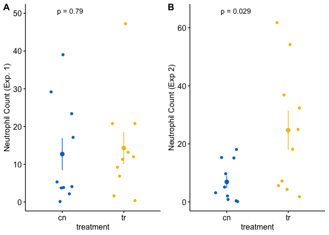

```r
# library(tidyverse)
# library(readxl)
# library(tableone)
# library(data.table)
# library(writexl)
#install.packages("lme4")
#install.packages("msm")
#library(lme4)
#library(msm)
```


```r
knitr::opts_chunk$set(echo = TRUE)

# wrangling packages
library(here) # here makes a project transportable
```

```
## here() starts at /Users/amstutzal/github/pebra
```

```r
library(janitor) # clean_names
```

```
## 
## Attaching package: 'janitor'
```

```
## The following objects are masked from 'package:stats':
## 
##     chisq.test, fisher.test
```

```r
library(readxl) # read excel, duh!
library(data.table) # magical data frames
library(magrittr) # pipes
library(stringr) # string functions
library(forcats) # factor functions

# analysis packages
library(emmeans) # the workhorse for inference
library(nlme) # gls and some lmm
library(lme4) # linear mixed models
```

```
## Loading required package: Matrix
```

```
## 
## Attaching package: 'lme4'
```

```
## The following object is masked from 'package:nlme':
## 
##     lmList
```

```r
library(lmerTest) # linear mixed model inference
```

```
## 
## Attaching package: 'lmerTest'
```

```
## The following object is masked from 'package:lme4':
## 
##     lmer
```

```
## The following object is masked from 'package:stats':
## 
##     step
```

```r
library(afex) # ANOVA linear models
```

```
## ************
## Welcome to afex. For support visit: http://afex.singmann.science/
```

```
## - Functions for ANOVAs: aov_car(), aov_ez(), and aov_4()
## - Methods for calculating p-values with mixed(): 'S', 'KR', 'LRT', and 'PB'
## - 'afex_aov' and 'mixed' objects can be passed to emmeans() for follow-up tests
## - Get and set global package options with: afex_options()
## - Set sum-to-zero contrasts globally: set_sum_contrasts()
## - For example analyses see: browseVignettes("afex")
## ************
```

```
## 
## Attaching package: 'afex'
```

```
## The following object is masked from 'package:lme4':
## 
##     lmer
```

```r
library(glmmTMB) # generalized linear models
```

```
## Warning in checkDepPackageVersion(dep_pkg = "TMB"): Package version inconsistency detected.
## glmmTMB was built with TMB version 1.9.3
## Current TMB version is 1.9.4
## Please re-install glmmTMB from source or restore original 'TMB' package (see '?reinstalling' for more information)
```

```r
library(MASS) # negative binomial and some other functions
library(car) # model checking and ANOVA
```

```
## Loading required package: carData
```

```r
library(DHARMa) # model checking
```

```
## This is DHARMa 0.4.6. For overview type '?DHARMa'. For recent changes, type news(package = 'DHARMa')
```

```r
# graphing packages
library(ggsci) # color palettes
library(ggpubr) # publication quality plots
```

```
## Loading required package: ggplot2
```

```r
library(ggforce) # better jitter
library(cowplot) # combine plots
```

```
## 
## Attaching package: 'cowplot'
```

```
## The following object is masked from 'package:ggpubr':
## 
##     get_legend
```

```r
library(knitr) # kable tables
library(kableExtra) # kable_styling tables
```

```
## Warning in !is.null(rmarkdown::metadata$output) && rmarkdown::metadata$output
## %in% : 'length(x) = 2 > 1' in coercion to 'logical(1)'
```

```r
# ggplot_the_model.R packages not loaded above
library(insight)
```

```
## 
## Attaching package: 'insight'
```

```
## The following object is masked from 'package:janitor':
## 
##     clean_names
```

```r
library(lazyWeave)

# use here from the here package
here <- here::here
# use clean_names from the janitor package
clean_names <- janitor::clean_names

# load functions written in the R file (ggplot_the_model)
# ggplot_the_model.R needs to be in the folder "R"
source_path <- here("R", "ggplot_the_model.R")
source(source_path)
```

```
## 
## Attaching package: 'rstatix'
```

```
## The following object is masked from 'package:MASS':
## 
##     select
```

```
## The following object is masked from 'package:janitor':
## 
##     make_clean_names
```

```
## The following object is masked from 'package:stats':
## 
##     filter
```

```r
data_folder <- "data"
image_folder <- "images"
output_folder <- "output"
```


```r
set.seed(4)
n <- 10
fake_data <- data.table(
    treatment = rep(c("cn", "tr"), each = n),
    neutrophil_count_exp1 = rnegbin(n*2, 
                                    mu = rep(c(10, 15), each = n),
                                    theta = 1),
    neutrophil_count_exp2 = rnegbin(n*2, 
                                    mu = rep(c(10, 20), each = n),
                                    theta = 1)
)
View(fake_data)
```


```r
gg_1 <- ggstripchart(data = fake_data,
                x = "treatment",
                y = "neutrophil_count_exp1",
                color = "treatment",
                palette = "jco",
                add = "mean_se",
                legend = "none") +
    ylab("Neutrophil Count (Exp. 1)") +
  stat_compare_means(method = "t.test",
                     label.y = 50,
                     label = "p.format") +
    NULL

gg_2<- ggstripchart(data = fake_data,
                x = "treatment",
                y = "neutrophil_count_exp2",
                color = "treatment",
                palette = "jco",
                add = "mean_se",
                legend = "none") +
  ylab("Neutrophil Count (Exp 2)") +
  stat_compare_means(method = "t.test",
                     label.y = 65,
                     label = "p.format") +
NULL

plot_grid(gg_1, gg_2, labels = "AUTO")
```

<!-- -->

